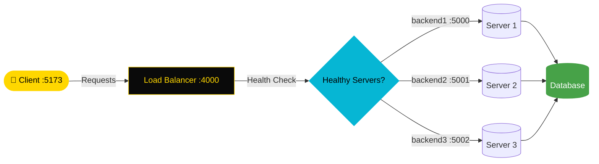

<div align="center">


[](https://git.io/typing-svg)

<br/>

<p align="center">
  <a href="https://github.com/NietoDeveloper">
    
  </a>
  <a href="https://committers.top/colombia#NietoDeveloper">
    
  </a>
  <a href="https://react.dev/">
    
  </a>
  <a href="https://nodejs.org/">
    
  </a>
  <a href="https://www.docker.com/">
    
  </a>
  <a href="https://opensource.org/licenses/MIT">
    
  </a>
</p>

<p align="center">
  <a href="https://github.com/NietoDeveloper/Clothing-Store-Docker">
    
  </a>
</p>

</div>

---

## 📋 Project Description

An **E-commerce Clothing Store** built as a full-stack application with a separated client and server, engineered for horizontal scalability through a custom Node.js load balancer and Docker Compose orchestration. Multiple backend instances can be run concurrently behind the load balancer, with built-in health checks routing traffic to available servers.

---

## 🗂️ Project Structure

```text
ClothingStore/
├── client/                # React frontend
│   ├── public/
│   └── src/
│       ├── assets/
│       ├── components/
│       ├── pages/
│       └── utils/
└── server/                # Node.js backend + load balancer
    ├── data/
    ├── db/
    └── routes/
```

---

## 🏗️ System Architecture



---

## 🛠️ Technology Stack

<div align="center">

| Layer | Technologies |
|:------|:-------------|
| 🎨 **Frontend** | React, Vite |
| ⚙️ **Backend** | Node.js |
| ⚖️ **Load Balancing** | Custom Node.js Load Balancer with Health Checks |
| 🐳 **DevOps** | Docker, Docker Compose |

</div>

---

## 🚀 How to Run the System

### 🖥️ Local Setup

**Step 1 — Open three terminals (minimum)** and navigate to the project folder in each one.

**Step 2 — Start the client**

```bash
cd client
npm run dev
```

**Step 3 — Start the load balancer**

```bash
cd server
node loadbalancer 4000
```

**Step 4 — Start the server**

```bash
node server 5000
```

**Step 5 — Initialize the databases**

```bash
node reset
```

**Step 6 — View the app**

Navigate to `localhost:5173` in your browser.

---

### 🐳 Run with Docker Compose

**Step 1 — Configure `server/loadbalancer.js`**

Uncomment:

```javascript
const servers = [
  { url: "http://backend1:5000", isHealthy: true },
  { url: "http://backend2:5001", isHealthy: true },
  { url: "http://backend3:5002", isHealthy: true },
];
```

And comment out:

```javascript
const servers = [
  { url: "http://localhost:5000", isHealthy: true },
  { url: "http://localhost:5001", isHealthy: true },
  { url: "http://localhost:5002", isHealthy: true },
];
```

**Step 2 — Build the containers**

```bash
docker-compose build
```

**Step 3 — Launch the ecosystem**

```bash
docker-compose up
```

---

## ℹ️ FYI

- You can run any combination of up to 2 load balancers and 3 servers on your local machine.
- Current load balancer ports are `4000` and `4001`.
- Current server ports are `5000`, `5001`, and `5002`.
- You can also open another terminal, `cd` into the `client` folder, and run `npm run dev` to run a secondary instance of the client side on your local machine. In this case, navigate to `localhost:5174` to view the secondary client.

---

## 👨‍💻 Author

**Manuel Nieto (NietoDeveloper)**

---

## 📄 License

This project is licensed under the **MIT License**.

<div align="center">

<br/>


</div>
