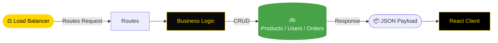

<div align="center">


[](https://git.io/typing-svg)

<br/>

<p align="center">
  <a href="https://nodejs.org/">
    
  </a>
  <a href="https://expressjs.com/">
    
  </a>
  <a href="https://opensource.org/licenses/MIT">
    
  </a>
</p>

<p align="center">
  <a href="https://github.com/NietoDeveloper/Clothing-Store-Docker/tree/main/server">
    
  </a>
</p>

</div>

---

## 📋 Overview

The **Clothing Store Server** is the backend component of the Clothing Store e-commerce project, built with **Node.js**. This server resides in the `server` directory within the main project folder, which is divided into `client` and `server` subdirectories.

---

## 🗂️ Project Structure

```text
server/
├── data/          # Seed and static data
├── db/             # Database connection and data access
└── routes/          # RESTful API endpoint definitions
```

---

## 🔄 API Request Flow



---

## ✨ Features

- **RESTful API:** For product and order management.
- **Client Integration:** Handles client requests for the e-commerce platform.
- **CRUD Operations:** Full support for products, users, and orders.

---

## 🛠️ Technologies

<div align="center">

| Technology | Role |
|:-----------|:-----|
| **Node.js** | Runtime environment for server-side logic |
| **Express** | Web framework for handling API routes |

</div>

---

## 🚀 Installation

**Step 1 — Clone the repository**

```bash
git clone https://github.com/NietoDeveloper/Clothing-Store-Docker
```

**Step 2 — Navigate to the server directory**

```bash
cd server
```

**Step 3 — Install dependencies**

```bash
npm install
```

**Step 4 — Start the server**

```bash
npm start
```

---

## 📖 Usage

- The server runs on `http://localhost:3000` by default.
- Connects with the client app in the `client` directory.
- Provides endpoints for product listings, cart management, and order processing.

---

## 🗂️ Project Structure Notes

- **`client/`:** Frontend application.
- **`server/`:** Backend server (this repository).

---

## 🤝 Contributing

Contributions are welcome! Fork the repository and submit a pull request.

---

## 📄 License

This project is licensed under the **MIT License**.

---

## 👨‍💻 Author

**Manuel Nieto (NietoDeveloper)**

<div align="center">

<br/>


</div>
